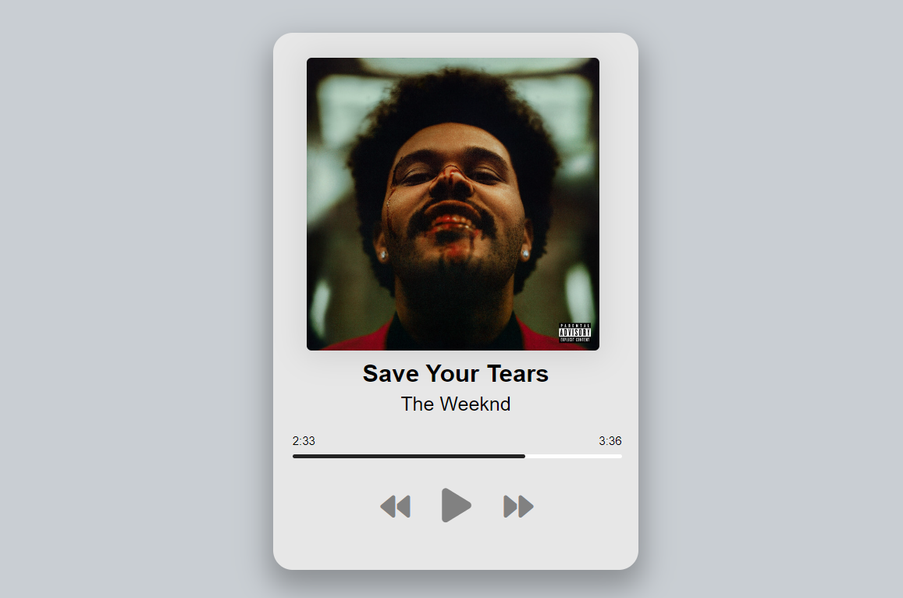

# Music Player

Projeto com o objetivo de ampliar o conhecimento relacionado ao 
áudio na web.

## Screenshots

## Aprendizado

- Ampliar o conhecimento com DOM
- Ampliar o conhecimento com input audio
- Manipular o "input audio" com as ferramentas corretas

## Autores

- [Pedro Henrique Bitencourt Dias](https://www.linkedin.com/in/pedro-henrique-bitencourt-dias-704a65170/)
- [@PedroHBitencourt](https://github.com/PedroHBitencourt)

